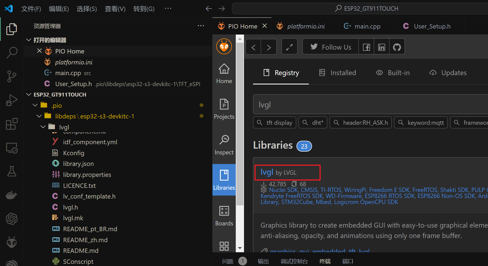
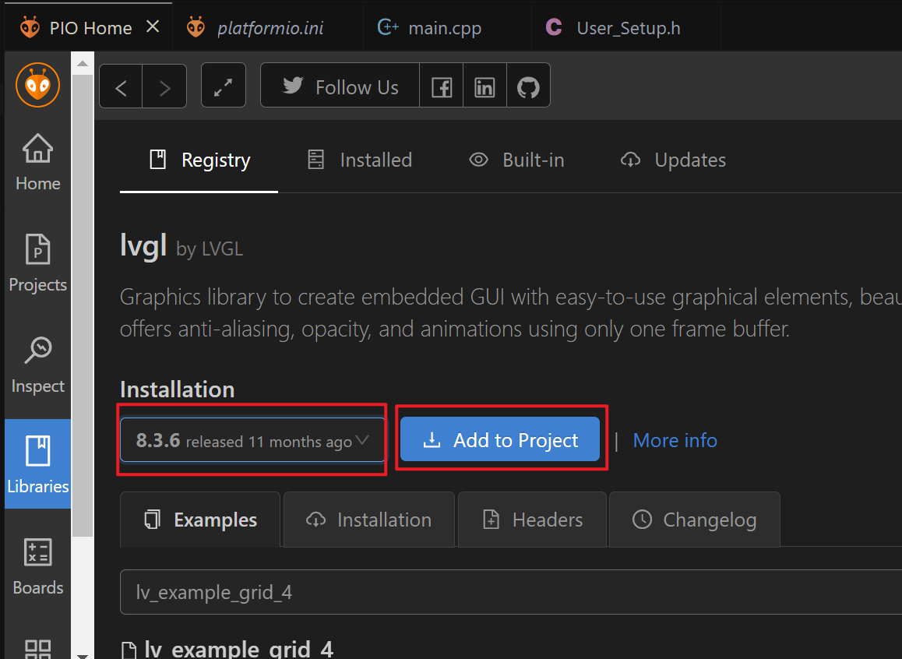

# ESP32_LVGL_TFT_DEMO
立创ESP32S3N8R8开发板+2.8寸电容触摸屏(ST7789+GT911)+LVGL.v8

# <font style="color: #6e9afc">配置</font> 

> 硬件：立创ESP32S3R8N8开发板 + 2.8寸TFT显示屏(ST7789) + 电容触摸(GT911)
> 软件：<font style="color: #36b0f3">Visual Studio Code</font> + <font style="color: #e57200">PlatformIO</font>


# <font style="color: #e57200">新建工程</font>

+ 点击侧边`PlatformIO`插件，新建工程
</img>

+ 依次设置工程名，开发板，框架
</img>

# <font style="color: #c16eff">屏幕测试</font>

## 添加TFT_eSPI

+ 添加屏幕驱动库`TFT_eSPI`，按如下图顺序
</img>
</img>

+ 添加TFT_eSPI到工程
</img>

+ 打开配置文件，可以看到已成功添加库
</img>

## 修改TFT_eSPI

+ 打开`.pio\libdeps\esp32-s3-devkitc-1\TFT_eSPI\User_Setup.h`文件
</img>

+ 根据屏幕驱动芯片解注释

```c++
// Only define one driver, the other ones must be commented out
// #define ILI9341_DRIVER       // Generic driver for common displays
//#define ILI9341_2_DRIVER     // Alternative ILI9341 driver, see https://github.com/Bodmer/TFT_eSPI/issues/1172
//#define ST7735_DRIVER      // Define additional parameters below for this display
//#define ILI9163_DRIVER     // Define additional parameters below for this display
//#define S6D02A1_DRIVER
//#define RPI_ILI9486_DRIVER // 20MHz maximum SPI
//#define HX8357D_DRIVER
//#define ILI9481_DRIVER
//#define ILI9486_DRIVER
//#define ILI9488_DRIVER     // WARNING: Do not connect ILI9488 display SDO to MISO if other devices share the SPI bus (TFT SDO does NOT tristate when CS is high)
#define ST7789_DRIVER      // Full configuration option, define additional parameters below for this display
//#define ST7789_2_DRIVER    // Minimal configuration option, define additional parameters below for this display
//#define R61581_DRIVER
//#define RM68140_DRIVER
//#define ST7796_DRIVER
//#define SSD1351_DRIVER
//#define SSD1963_480_DRIVER
//#define SSD1963_800_DRIVER
//#define SSD1963_800ALT_DRIVER
//#define ILI9225_DRIVER
//#define GC9A01_DRIVER
```

+ 根据屏幕大小设置宽高

```c++
// For ST7789, ST7735, ILI9163 and GC9A01 ONLY, define the pixel width and height in portrait orientation
// #define TFT_WIDTH  80
// #define TFT_WIDTH  128
// #define TFT_WIDTH  172 // ST7789 172 x 320
// #define TFT_WIDTH  170 // ST7789 170 x 320
#define TFT_WIDTH  240 // ST7789 240 x 240 and 240 x 320
// #define TFT_HEIGHT 160
// #define TFT_HEIGHT 128
// #define TFT_HEIGHT 240 // ST7789 240 x 240
#define TFT_HEIGHT 320 // ST7789 240 x 320
// #define TFT_HEIGHT 240 // GC9A01 240 x 240
```

+ 根据连线设置引脚

```c++
// ### EDIT THE PIN NUMBERS IN THE LINES FOLLOWING TO SUIT YOUR ESP32 SETUP   ###
// For ESP32 Dev board (only tested with ILI9341 display)
// The hardware SPI can be mapped to any pins
//#define TFT_MISO 19
#define TFT_MOSI 17
#define TFT_SCLK 18
#define TFT_CS   15  // Chip select control pin
#define TFT_DC    16  // Data Command control pin
//#define TFT_RST   4  // Reset pin (could connect to RST pin)
#define TFT_RST  -1  // Set TFT_RST to -1 if display RESET is connected to ESP32 board RST
```

## 修改main.cpp

在屏幕上从上到下分别显示<font style="color: #ff0000">红</font><font style="color: #00ff00">绿</font><font style="color: #0000ff">蓝</font>三色，以及<font style="background: #8c8c8c;color: #ffffff">白色</font>文字，用来测试屏幕颜色显示是否正常。

```c++
#include <Arduino.h>
#include <SPI.h>
#include <TFT_eSPI.h> // Hardware-specific library
#define TFT_GREY 0x5AEB
TFT_eSPI tft = TFT_eSPI();       // Invoke custom library
void setup() {
  tft.init();
  tft.setRotation(0);
  tft.fillScreen(TFT_GREY);
  tft.setTextColor(TFT_WHITE, TFT_GREY);  // Adding a background colour erases previous text automatically
  tft.fillRect(0,0,240,50,TFT_RED);
  tft.fillRect(0,50,240,50,TFT_GREEN);
  tft.fillRect(0,100,240,50,TFT_BLUE);
  tft.drawCentreString("Time flies",120,260,4);
}
void loop() {
  // put your main code here, to run repeatedly:
}
```

## 下载调试

+ 编译下载
</img>

+ 根据屏幕显示情况修改`User_Setup.h`文件

如果颜色反转(白色显示为黑色)，如下图所示，则取消下一个注释，尝试两个选项，其中一个选项应该纠正反转。
</img>

```c++
// If colours are inverted (white shows as black) then uncomment one of the next
// 2 lines try both options, one of the options should correct the inversion.
// #define TFT_INVERSION_ON
#define TFT_INVERSION_OFF
```
修改后，如下图所示，白色正常显示，但是RGB顺序存在问题
</img>

仅对于ST7735, ST7789和ILI9341，如果显示器上的蓝色和红色交换，则定义颜色顺序，一次尝试一个选项来找到显示的正确颜色顺序

```c++
// For ST7735, ST7789 and ILI9341 ONLY, define the colour order IF the blue and red are swapped on your display
// Try ONE option at a time to find the correct colour order for your display
//  #define TFT_RGB_ORDER TFT_RGB  // Colour order Red-Green-Blue
 #define TFT_RGB_ORDER TFT_BGR  // Colour order Blue-Green-Red
```
修改后，如下图所示，RGB顺序正常
</img>

# <font style="color: #6c9ba6">LVGL测试</font>

## 添加LVGL

+ 根据实际情况，选择lvgl版本
</img>
</img>

+ 添加lvgl到工程
</img>

## 修改LVGL

+ 打开`.pio\libdeps\esp32-s3-devkitc-1\lvgl\lv_conf_template.h`文件

  将此文件重命名为`lv_conf.h`

</img>

+ 使能lvgl

```c++
/* clang-format off */
#if 1 /*Set it to "1" to enable content*/
#ifndef LV_CONF_H
#define LV_CONF_H
```

+ 设置周期

默认显示刷新周期。LVG将重新绘制改变的区域与这个周期时间
输入设备读取周期毫秒

```c++
/*Default display refresh period. LVG will redraw changed areas with this period time*/
#define LV_DISP_DEF_REFR_PERIOD 1      /*[ms]*/
/*Input device read period in milliseconds*/
#define LV_INDEV_DEF_READ_PERIOD 1     /*[ms]*/
```

+ 心跳使能

```c++
/*Use a custom tick source that tells the elapsed time in milliseconds.
 *It removes the need to manually update the tick with `lv_tick_inc()`)*/
#define LV_TICK_CUSTOM 1
#if LV_TICK_CUSTOM
```

+ 使能测试案例

```c++
/*Show some widget. It might be required to increase `LV_MEM_SIZE` */
#define LV_USE_DEMO_WIDGETS 1
#if LV_USE_DEMO_WIDGETS
#define LV_DEMO_WIDGETS_SLIDESHOW 0
#endif
```

+ 更改文件路径

  将`.pio\libdeps\esp32-s3-devkitc-1\lvgl\demos`文件夹移动至`.pio\libdeps\esp32-s3-devkitc-1\lvgl\src\demos`

+ 修改main.cpp

  将`.pio\libdeps\esp32-s3-devkitc-1\lvgl\examples\arduino\LVGL_Arduino\LVGL_Arduino.ino`文件内容复制

  + 设置头文件

  ```c++
  #include <Arduino.h>
  #include <SPI.h>
  #include <lvgl.h>
  #include <TFT_eSPI.h> // Hardware-specific library
  #include "demos/lv_demos.h"
  ```

  + 设置宽高

  ```c++
  static const uint16_t screenWidth  = 320;
  static const uint16_t screenHeight = 240;
  ```

  + 修改类型

  `lv_disp_t`修改为`lv_disp_drv_t`

  `lv_indev_t`修改为`lv_indev_drv_t`

  + 注释掉触摸部分


## 修改完成

最终`main.cpp`文件内容如下
```c++
#include <Arduino.h>
#include <SPI.h>
#include <lvgl.h>
#include <TFT_eSPI.h> // Hardware-specific library
#include "demos/lv_demos.h"
/*Change to your screen resolution*/
static const uint16_t screenWidth  = 320;
static const uint16_t screenHeight = 240;
static lv_disp_draw_buf_t draw_buf;
static lv_color_t buf[ screenWidth * 10 ];
TFT_eSPI tft = TFT_eSPI(screenWidth, screenHeight); /* TFT instance */
/* Display flushing */
void my_disp_flush( lv_disp_drv_t *disp, const lv_area_t *area, lv_color_t *color_p )
{
    uint32_t w = ( area->x2 - area->x1 + 1 );
    uint32_t h = ( area->y2 - area->y1 + 1 );
    tft.startWrite();
    tft.setAddrWindow( area->x1, area->y1, w, h );
    tft.pushColors( ( uint16_t * )&color_p->full, w * h, true );
    tft.endWrite();
    lv_disp_flush_ready( disp );
}
/*Read the touchpad*/
// void my_touchpad_read( lv_indev_drv_t * indev_driver, lv_indev_data_t * data )
// {
//     uint16_t touchX, touchY;
//     bool touched = tft.getTouch( &touchX, &touchY, 600 );
//     if( !touched )
//     {
//         data->state = LV_INDEV_STATE_REL;
//     }
//     else
//     {
//         data->state = LV_INDEV_STATE_PR;
//         /*Set the coordinates*/
//         data->point.x = touchX;
//         data->point.y = touchY;
//         Serial.print( "Data x " );
//         Serial.println( touchX );
//         Serial.print( "Data y " );
//         Serial.println( touchY );
//     }
// }
void setup()
{
    Serial.begin( 115200 ); /* prepare for possible serial debug */
    String LVGL_Arduino = "Hello Arduino! ";
    LVGL_Arduino += String('V') + lv_version_major() + "." + lv_version_minor() + "." + lv_version_patch();
    Serial.println( LVGL_Arduino );
    Serial.println( "I am LVGL_Arduino" );
    lv_init();
    tft.begin();          /* TFT init */
    tft.setRotation( 3 ); /* Landscape orientation, flipped */
    /*Set the touchscreen calibration data,
     the actual data for your display can be acquired using
     the Generic -> Touch_calibrate example from the TFT_eSPI library*/
    uint16_t calData[5] = { 275, 3620, 264, 3532, 1 };
    // tft.setTouch( calData );
    lv_disp_draw_buf_init( &draw_buf, buf, NULL, screenWidth * 10 );
    /*Initialize the display*/
    static lv_disp_drv_t disp_drv;
    lv_disp_drv_init( &disp_drv );
    /*Change the following line to your display resolution*/
    disp_drv.hor_res = screenWidth;
    disp_drv.ver_res = screenHeight;
    disp_drv.flush_cb = my_disp_flush;
    disp_drv.draw_buf = &draw_buf;
    lv_disp_drv_register( &disp_drv );
    /*Initialize the (dummy) input device driver*/
    static lv_indev_drv_t indev_drv;
    lv_indev_drv_init( &indev_drv );
    indev_drv.type = LV_INDEV_TYPE_POINTER;
    // indev_drv.read_cb = my_touchpad_read;
    lv_indev_drv_register( &indev_drv );
#if 0
    /* Create simple label */
    lv_obj_t *label = lv_label_create( lv_scr_act() );
    lv_label_set_text( label, LVGL_Arduino.c_str() );
    lv_obj_align( label, LV_ALIGN_CENTER, 0, 0 );
#else
    lv_demo_widgets();            // OK
#endif
    Serial.println( "Setup done" );
}
void loop()
{
    lv_timer_handler(); /* let the GUI do its work */
    delay( 5 );
}
```
## 编译下载
显示效果如下图
</img>

# <font style="color: #26c492">触摸测试</font>

## 添加`bb_captouch`

</img>

## 修改`main.cpp`

+ 添加头文件

  ```c++
  #include <bb_captouch.h>
  ```

+ 设置触摸芯片引脚

  ```c++
  // These defines are for a low cost ESP32 LCD board with the GT911 touch controller
  #define TOUCH_SDA  4
  #define TOUCH_SCL  2
  #define TOUCH_INT 3
  #define TOUCH_RST 1
  ```

+ 设置参数

  ```c++
  BBCapTouch bbct;
  const char *szNames[] = {"Unknown", "FT6x36", "GT911", "CST820"};
  ```

+ 初始化

  ```c++
  bbct.init(TOUCH_SDA, TOUCH_SCL, TOUCH_RST, TOUCH_INT);
  ```

+ 修改`my_touchpad_read`函数

  这里的x,y坐标需要根据实际情况修改

  </img>

  ```c++
  /*Read the touchpad*/
  void my_touchpad_read( lv_indev_drv_t * indev_driver, lv_indev_data_t * data )
  {
      TOUCHINFO ti;
      if(bbct.getSamples(&ti))
      {
          data->state = LV_INDEV_STATE_PR;
          /*Set the coordinates*/
          data->point.x = screenWidth - ti.y[0];
          data->point.y = ti.x[0];
          Serial.print( "Data x " );
          Serial.println( screenWidth - ti.y[0] );
          Serial.print( "Data y " );
          Serial.println( ti.x[0] );
      }
      else
      {
          data->state = LV_INDEV_STATE_REL;
      }
  }
  ```

## 修改完成

最终`main.cpp`文件内容如下
```c++
#include <Arduino.h>
#include <SPI.h>
#include <lvgl.h>
#include <TFT_eSPI.h> // Hardware-specific library
#include "demos/lv_demos.h"
#include <bb_captouch.h>
// These defines are for a low cost ESP32 LCD board with the GT911 touch controller
#define TOUCH_SDA  4
#define TOUCH_SCL  2
#define TOUCH_INT 3
#define TOUCH_RST 1
BBCapTouch bbct;
const char *szNames[] = {"Unknown", "FT6x36", "GT911", "CST820"};
/*Change to your screen resolution*/
static const uint16_t screenWidth  = 320;
static const uint16_t screenHeight = 240;
static lv_disp_draw_buf_t draw_buf;
static lv_color_t buf[ screenWidth * 10 ];
TFT_eSPI tft = TFT_eSPI(screenWidth, screenHeight); /* TFT instance */
/* Display flushing */
void my_disp_flush( lv_disp_drv_t *disp, const lv_area_t *area, lv_color_t *color_p )
{
    uint32_t w = ( area->x2 - area->x1 + 1 );
    uint32_t h = ( area->y2 - area->y1 + 1 );
    tft.startWrite();
    tft.setAddrWindow( area->x1, area->y1, w, h );
    tft.pushColors( ( uint16_t * )&color_p->full, w * h, true );
    tft.endWrite();
    lv_disp_flush_ready( disp );
}
/*Read the touchpad*/
void my_touchpad_read( lv_indev_drv_t * indev_driver, lv_indev_data_t * data )
{
    // uint16_t touchX, touchY;
    TOUCHINFO ti;
    if(bbct.getSamples(&ti))
    {
        data->state = LV_INDEV_STATE_PR;
        /*Set the coordinates*/
        data->point.x = screenWidth - ti.y[0];
        data->point.y = ti.x[0];
        Serial.print( "Data x " );
        Serial.println( screenWidth - ti.y[0] );
        Serial.print( "Data y " );
        Serial.println( ti.x[0] );
    }
    else
    {
        data->state = LV_INDEV_STATE_REL;
    }
}
void setup()
{
    Serial.begin( 115200 ); /* prepare for possible serial debug */
    String LVGL_Arduino = "Hello Arduino! ";
    LVGL_Arduino += String('V') + lv_version_major() + "." + lv_version_minor() + "." + lv_version_patch();
    Serial.println( LVGL_Arduino );
    Serial.println( "I am LVGL_Arduino" );
    lv_init();
    tft.begin();          /* TFT init */
    tft.setRotation( 3 ); /* Landscape orientation, flipped */
    bbct.init(TOUCH_SDA, TOUCH_SCL, TOUCH_RST, TOUCH_INT);
    int iType = bbct.sensorType();
    Serial.printf("Sensor type = %s\n", szNames[iType]);
    lv_disp_draw_buf_init( &draw_buf, buf, NULL, screenWidth * 10 );
    /*Initialize the display*/
    static lv_disp_drv_t disp_drv;
    lv_disp_drv_init( &disp_drv );
    /*Change the following line to your display resolution*/
    disp_drv.hor_res = screenWidth;
    disp_drv.ver_res = screenHeight;
    disp_drv.flush_cb = my_disp_flush;
    disp_drv.draw_buf = &draw_buf;
    lv_disp_drv_register( &disp_drv );
    /*Initialize the (dummy) input device driver*/
    static lv_indev_drv_t indev_drv;
    lv_indev_drv_init( &indev_drv );
    indev_drv.type = LV_INDEV_TYPE_POINTER;
    indev_drv.read_cb = my_touchpad_read;
    lv_indev_drv_register( &indev_drv );
#if 0
    /* Create simple label */
    lv_obj_t *label = lv_label_create( lv_scr_act() );
    lv_label_set_text( label, LVGL_Arduino.c_str() );
    lv_obj_align( label, LV_ALIGN_CENTER, 0, 0 );
#else
    // uncomment one of these demos
    lv_demo_widgets();            // OK
#endif
    Serial.println( "Setup done" );
}
void loop()
{
    lv_timer_handler(); /* let the GUI do its work */
    delay( 5 );
}
```

## 编译下载
触摸显示效果如下图所示
</img>

# END

<center> 2024 <font color=#00bcd9>Hi1L</font></center>
